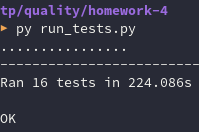

# homework-4

### Letter testing checklist: 

- **Send letter**
    - Send a default letter (with receiver, topic and text). Check that the letter has arrived.
    - Send a letter without topic. Check that the letter has arrived.
    - Send an empty letter (without topic & text). Check that the letter has arrived.
    - Try to send a letter without receiver. Check that the matching error showed up.
    - Send a letter marked as important (click on "mark as important" button before sending). Check that the arrived letter is marked as important.
    - Send a letter with a read status notification. Open the arrived letter and click on the "mark as read" button. Check that the "your letter was marked as read" notification letter arrived.
#
- **Some operations without sending a letter**
    - Cancel letter. Check that no letter has arrived.
    - Add letter to templates. Check that a new template is added.
    - Maximize and minimize the new letter window. Check that the written letter has not changed.
    - Close letter. Check that no letter has arrived.
    - Collapse and expand letter. Check that the written letter has not changed.
    - Collapse letter. Check that the letter is stored in drafts.
    - Click on the "offer call" button. Check that the call invitation appeared in the letter.
    - Translate letter. Write letter and click the "translate" button, approve changes. Check that the letter text is translated.
    - Cancel letter translation. Write letter and click the "translate" button, abort changes. Check that the letter text is not translated.
    - Insert signature. Click on the "insert signature" button and check that the signature appeared in the letter.
#
### Testing results

#
### How to run tests
If you run tests first time, use
```bash
pip3 install -r requirements.txt
```
to install all needed libraries.
#
After that add the needed environment variiables
```bash
export LOGIN=#your_login_here
export PASSWORD=#your_password_here
```
#
And there you go, now you can run tests with this command
```bash
python3 run_tests.py
```
